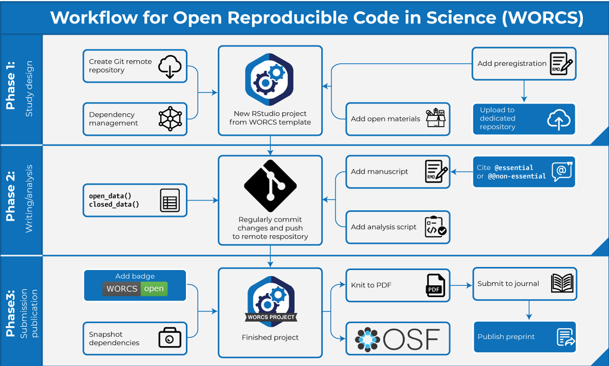

# Introduction to WORCS {#intro}

The Workflow for Open Reproducible Code in Science (WORCS) is an easy to adopt approach to ensuring a research project meets the requirements of Open Science from the start. It is based on a "good enough" philosophy, prioritizing user-friendliness over exhaustiveness. It can be used either in absence of, or in parallel to, existing requirements for Open workflows. It can also be enhanced with more elaborate solutions for specific issues.

The workflow is illustrated below:

 WORCS relies on a set of free, open source software solutions which, namely:

1.  Dynamic document generation
2.  Version control
3.  Dependency management

Moreover, it helps adhere to the TOP guidelines and FAIR principles. It also accounts for open and closed data sharing options.

The following presentation dives into these concepts further:

<iframe src="https://cjvanlissa.github.io/worcshop/MPIB_2020.html#1" width="672" height="400px" data-external="1"></iframe>

[Slides](https://cjvanlissa.github.io/worcshop/MPIB_2020.html#1)

<iframe width="560" height="315" src="https://www.youtube.com/embed/uzjpN_yFeUU" title="YouTube video player" frameborder="0" allow="accelerometer; autoplay; clipboard-write; encrypted-media; gyroscope; picture-in-picture" allowfullscreen>

</iframe>
